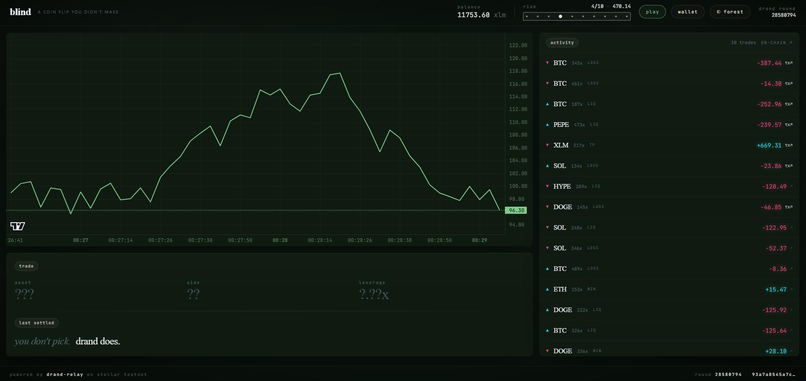
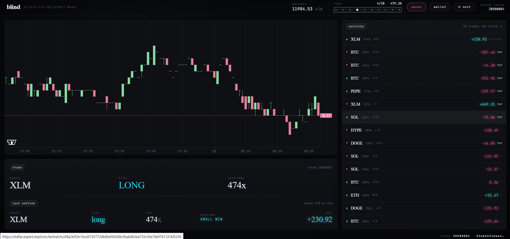
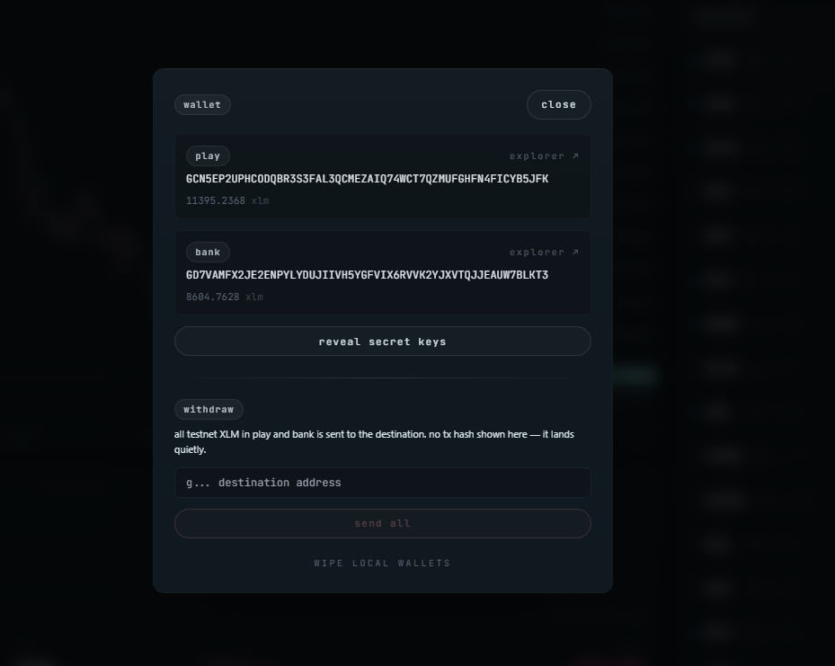
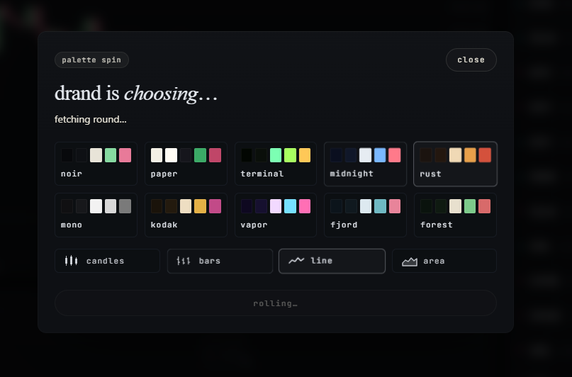

# blind

> **a coin flip you didn't make.**
> Live at **[blind.utkukaya.co](https://blind.utkukaya.co)** · drand × Stellar testnet



---

## What is this

**blind** is a perp-trading mockup where you don't actually trade. You just watch.

Every few seconds the page picks a token, a side, a leverage, and an outcome — **and you have zero control over any of it.** All of that is derived from a fresh public-randomness beacon called **drand**, relayed onto the Stellar testnet by the [Drand-Relay](https://github.com/kaankacar/Drand-Relay) Soroban contract. Each settlement is a real on-chain payment on Stellar testnet, signed by a wallet the site creates for you in the browser.

You press play. You watch the cards roll. You can't pick anything. drand picks for you.

---

## How the randomness is used

One drand round is a 32-byte unforgeable random value. Every cycle pulls a single round and uses *different bytes* of it for different decisions, so each round can be independently verified against the public drand beacon — the chain you see, the trade you got, the colour of the page, everything came from the same number.

| bytes | what it drives |
| --- | --- |
| `0..4` | **asset** — index into `[BTC, ETH, SOL, XLM, DOGE, PEPE, HYPE]` mod 7 |
| `4` | **side** — parity → long / short |
| `5..7` | **leverage** — uniform 100x..500x |
| `7` | **outcome bucket** — liquidation, small loss, small win, take-profit |
| `8` | **outcome magnitude** — within the bucket |
| `0..4` of a separate "spin" round | **palette** — 1 of 10 colour themes |
| `4..8` of the same spin round | **chart style** — candles / bars / line / area |

There is no RNG anywhere in the code. Math.random isn't called. Every visible decision traces back to a publicly verifiable drand round.

### Outcome buckets

With leverage in the 100x–500x range, a fixed-PnL "win × multiplier" doesn't make sense — a tiny price tick already moves orders of magnitude vs stake. So blind uses four discrete outcome buckets, picked from the drand byte:

- **liq** (25%) — full stake gone, instant. No suspense.
- **small loss** (40%) — −5% to −50% of stake. The market just bled you.
- **small win** (25%) — +5% to +50% of stake. You scratched a tick.
- **tp** (10%) — +100% to +500% of stake. A take-profit windfall.

Near-fair EV with high-variance tails.

---

## What you'll see



*A settled trade in the noir palette. The trade card shows the full hand drand dealt — XLM long, 474x leverage. The last-settled row beneath it shows the outcome (`SMALL WIN`) and PnL (+230.92). Every row in the activity panel that shows `tx↗` is a clickable link to the actual settlement payment on stellar.expert.*

The cycle for one trade lasts roughly **11–13 seconds**, paced so you can read it:

1. **asset spin** (~1s) → name rolls through the 7 tickers, lands on one. Chart switches to that asset's real Binance / OKX klines.
2. **2-second hold.** Just the asset is visible.
3. **side spin** (~0.5s) → long or short.
4. **2-second hold.**
5. **leverage spin** (~0.5s) → integer between 100x and 500x.
6. **2-second open hold** — full trade visible. *No outcome yet.*
7. **3.5-second suspense** (skipped on liquidation) — only the outcome and PnL are still hidden.
8. **reveal** — `WIN / LOSS / LIQ / TP` and the PnL number flip in. The real settlement TX fires from `play ↔ bank` on Stellar testnet.
9. **2-second cooldown** before the next drand round is consumed.

Meanwhile the chart is a real live chart of whatever asset is currently in play — 100 one-minute candles fetched from Binance, or OKX as a fallback for tokens Binance doesn't list (HYPE).

---

## The wallet model



*Two Stellar testnet accounts created in the browser: `play` holds your game balance, `bank` is the counterparty. Both have explorer links, both balances refresh live from Horizon, both secret keys can be revealed and copied. The withdraw input drains both accounts to any destination address you paste — silently, no tx-hash dialogs.*

There is no MetaMask, Freighter, or external wallet to connect. The site **creates two Stellar testnet accounts on first visit**, funds both with 10,000 XLM via Friendbot, and stores the secret keys in browser localStorage.

- **`play`** holds your game balance — this is what the header shows.
- **`bank`** is the counterparty.

When a trade is a win, `bank → play` sends the PnL. When it's a loss or liquidation, `play → bank` collects the stake. Every one of those is a real on-chain payment with a memo like `BLIND R28580794 +669.31`. Click any settled row in the activity panel and you land on the actual TX on stellar.expert.

When you're done, **wallet → withdraw** drains both accounts to any address you paste in. No tx hash dialogs, no confirmation prompts — the site signs locally and submits silently. You can also reveal the secret keys at any time if you want to sweep the wallet yourself.

---

## drand "owns" the design too



*Mid-roll: drand is fetching a fresh round and the highlight is bouncing through the ten palettes and four chart styles before it lands.*

There's a **`spin` button** in the header. Click it and drand picks the palette **and** the chart style at the same time, using two independent slices of the same round's randomness:

- **palettes (10)** — `noir`, `paper`, `terminal`, `midnight`, `rust`, `mono`, `kodak`, `vapor`, `fjord`, `forest`. Each one has its own background, ink tone, grain density, and vignette weight.
- **chart styles (4)** — candlesticks, OHLC bars, line, filled area.

The same drand bytes that picked the asset of a trade could just as easily have picked the colour of the page. The narrative is consistent: *the chain decides everything, even the look.* You can also tap a palette or style manually if you don't want to roll for it.

---

## Risk control (the only knob you have, sort of)

You have one input: how much of your `play` balance to put on each round. It's a 10-step track in the header labeled **`risk`**. Click once to **unlock** it — the cursor starts bouncing 1↔10 by itself. Click again to **lock** it on whatever number it landed on. That's your stake percent (1%–10% of balance).

You don't pick — you stop. It's the only decision you make, and even that is half-deterministic.

---

## Stack

- **Next.js 14** (App Router) + **Tailwind**
- **`@stellar/stellar-sdk` v13** — keypair generation, Friendbot, Horizon, payment ops, transaction signing
- **`lightweight-charts`** v4 — candle / bar / line / area rendering
- **drand REST** — `https://stellardrand.duckdns.org/random` and `/feed` (the Drand-Relay's HTTP feeder)
- **Binance + OKX** klines — real per-asset price chart context
- **localStorage** — wallet secrets, history, risk preference, palette

No backend. No environment variables. No external auth. The whole thing is a static Next.js bundle that talks to public APIs.

---

## Run it locally

```bash
npm install
npm run dev
```

Then open `http://localhost:3000`. First visit will prompt you to create the local wallets — both get Friendbot-funded automatically, and you're playing in about 5 seconds.

---

## Verify a trade against drand

Every row in the activity panel links to its settlement TX on stellar.expert. The TX memo carries the round number, e.g. `BLIND R28580794 +669.31`. You can take that round number and hit the public drand beacon directly:

```bash
curl https://api.drand.sh/public/28580794
```

The `randomness` field there is the exact 32-byte value that drove your trade. Run the byte derivation in `lib/derive.ts` against it and you'll reconstruct the same asset, side, leverage, and outcome — bit-for-bit.

---

## Why bother

A demo of how a public randomness beacon (drand) plus a verifiable randomness relay on a cheap chain (Stellar) can produce an end-to-end auditable experience that nobody, including the site operator, can rig. The site is unfair only by design — the math is on the page.

---

## Credits

- **drand network** — the league-of-entropies threshold BLS randomness beacon.
- **[Drand-Relay](https://github.com/kaankacar/Drand-Relay)** by [@kaankacar](https://github.com/kaankacar) — the Soroban verifier + HTTP feeder this site reads from.
- **Stellar Development Foundation** — testnet Horizon, Friendbot, ed25519 SDK.

---

## License

MIT — see [`LICENSE`](./LICENSE). Open-source; do whatever you like with it. PRs welcome.

This is a testnet-only educational toy. Nothing here moves real money. Don't deploy it against mainnet without auditing the wallet flow first — the secret keys live in browser localStorage.
